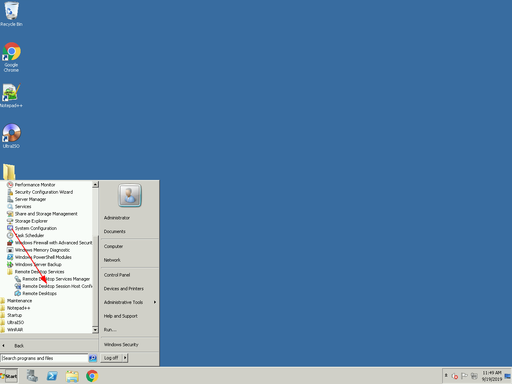
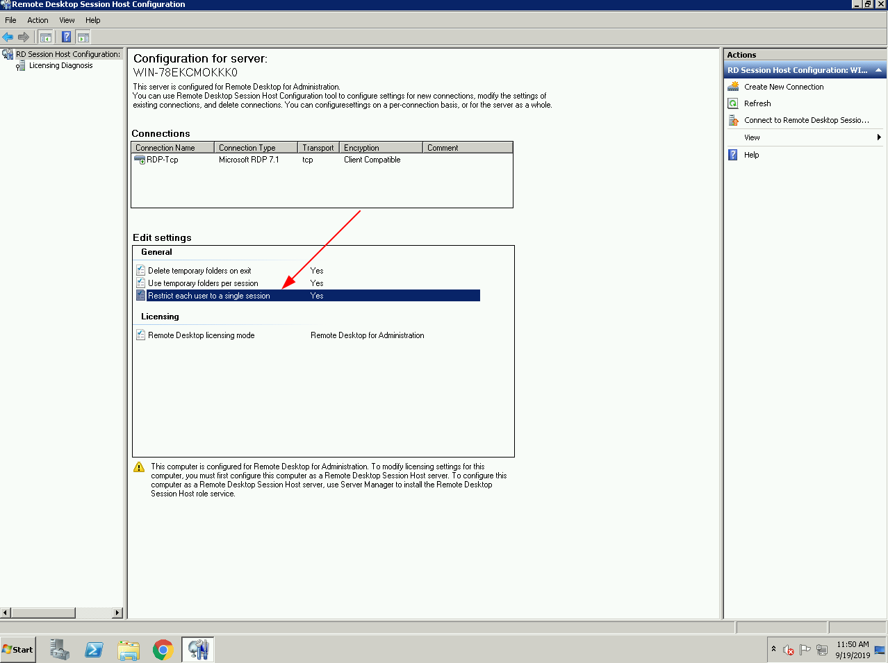
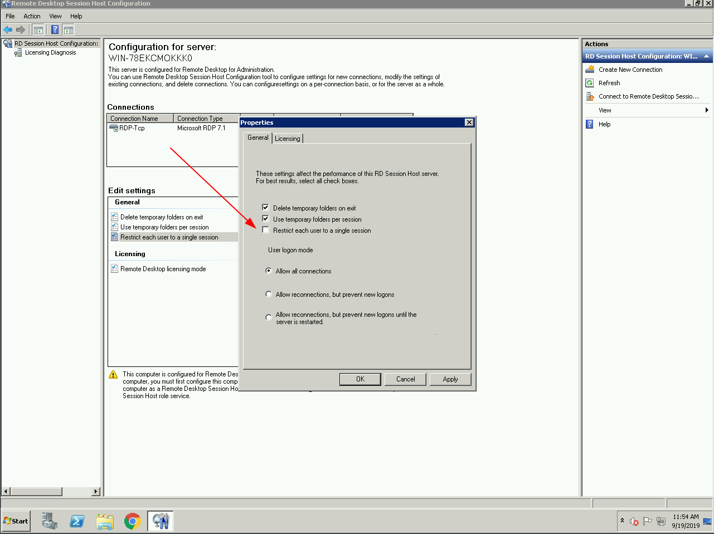
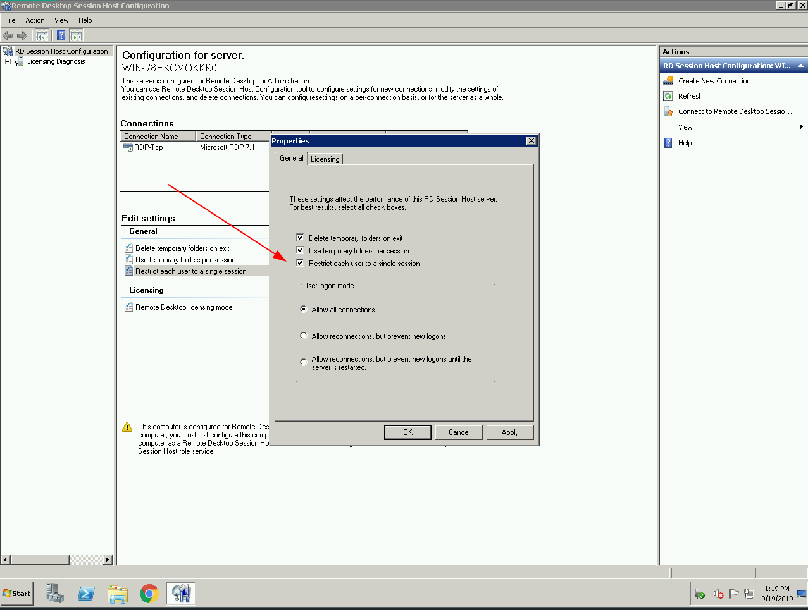

> **Description:**   Làm thế nào để Enable/Disable Multiple RDP Sessions trong Windows 2008 R2
>
> **Author:** TanTa 

Mặc định,  Windows 2008/2008R2 servers cho phép kết nối hai Remote Desktop đồng thời. Bạn có thể tùy chọn vô hiệu hóa nhiều kết nối RDP nếu muốn. Nếu chỉ có một phiên làm việc remote Desktop có sẵn và bạn nhảy vào sử dụng phiên làm việc của người khác, bạn có thể chọn để cho phép nhiều phiên RDP. Bài viết này mô tả quá trình enabling and disabling multiple sessions. 

## I. Enable Multiple RDP Sessions :

### 1. Kết nối vào server sử dụng ***Remote Desktop***.

### 2. Mở Start trên Windows ( phím Windows trên bàn phím)  **Start > Administrative Tools > Remote Desktop Services**.

### 3. **Start > Administrative Tools > Remote Desktop Services > Remote Desktop Session Host Configuration**.

### 4. Double click **Restrict Each User to a Single Session** và bỏ chọn **Restrict each user to a single session**.

## II. Disable Multiple RDP Sessions

Tương tự như **Enable Multiple RDP Sessions** 

### 1. Mở Start trên Windows ( phím Windows trên bàn phím)  **Start > Administrative Tools > Remote Desktop Services**.

### 2. **Start > Administrative Tools > Remote Desktop Services > Remote Desktop Session Host Configuration**.

### 3. Double click **Restrict Each User to a Single Session** và chọn **Restrict each user to a single session**.

